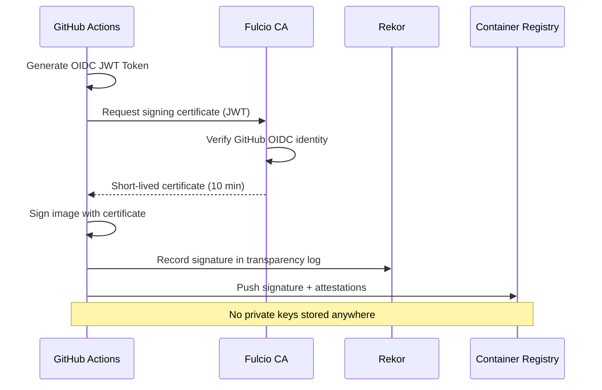

#  SLSA Level 3 Supply Chain Security Lab

> Production-grade supply chain security pipeline implementing **SLSA Level 3** compliance with automated SBOM generation, keyless image signing, non-falsifiable provenance, and Kubernetes policy enforcement.

[](https://github.com/rap1p1/secure-payment-platform/actions/workflows/supply-chain-security.yaml)
[](https://slsa.dev)

---

##  What Is This?

This project demonstrates **enterprise-grade supply chain security** for a Go-based payment service, implementing all four pillars of modern software supply chain protection:

| Pillar | Tool | Purpose |
|--------|------|---------|
| **SBOM** | Syft | Software Bill of Materials — know exactly what's inside your images |
| **Signing** | Cosign + Sigstore | Keyless image signing via GitHub OIDC — zero static secrets |
| **Provenance** | SLSA GitHub Generator | Non-falsifiable build provenance — proves HOW the image was built |
| **Enforcement** | Kyverno | Policy-as-code — blocks unsigned/unverified images from deploying |

### Why SLSA Level 3?

After SolarWinds, Log4Shell, and xz-utils attacks, the industry learned: **attackers don't break your code — they break your build pipeline**. SLSA Level 3 guarantees:

-  Provenance is generated automatically by an **isolated, trusted builder**
-  No manual intervention can modify the build process
-  Cryptographic signatures prove the exact source → artifact chain
-  Policy enforcement blocks any artifact that doesn't meet these standards

---

##  Architecture

```mermaid
graph LR
    A["👨‍💻 Developer<br/>Push Code"] --> B["⚙️ GitHub Actions<br/>CI Pipeline"]
    B --> C["🐳 Build Docker Image<br/>(Multi-stage, Distroless)"]
    C --> D["📋 Generate SBOM<br/>(Syft → CycloneDX)"]
    D --> E["✍️ Sign Image<br/>(Cosign + GitHub OIDC)"]
    E --> F["📜 SLSA Provenance<br/>(Isolated Builder)"]
    F --> G["📦 Push to GHCR<br/>(Image + SBOM + Provenance)"]
    G --> H["🔍 Verify All Artifacts<br/>(Cosign + SLSA Verifier)"]
    H --> I["📝 Update K8s Manifests<br/>(Digest-pinned)"]
    I --> J["🔄 ArgoCD Sync<br/>(GitOps)"]
    J --> K{"🛡️ Kyverno<br/>Policy Check"}
    K -->|"✅ Valid"| L["🟢 Pod Running"]
    K -->|"❌ Invalid"| M["🔴 BLOCKED"]
```



###  Keyless Signing Flow (Zero Static Secrets)



---

##  Project Structure

```
secure-payment-platform/
├── .github/workflows/
│   ├── supply-chain-security.yaml    # CI: Build → SBOM → Sign → Provenance
│   └── verify-and-deploy.yaml        # CD: Verify → Deploy via ArgoCD
├── app/                              # Go Payment Service
│   ├── main.go                       # Entry point with graceful shutdown
│   ├── handlers/                     # HTTP handlers (payments, health)
│   ├── middleware/                   # Logging, recovery, security headers
│   ├── models/                       # Data models with validation
│   └── Dockerfile                    # Multi-stage build (distroless)
├── k8s/
│   ├── base/                         # Base K8s manifests
│   ├── overlays/production/          # Production Kustomize overlay
│   └── policies/                     # Kyverno policies
│       ├── require-signed-images.yaml
│       ├── require-slsa-provenance.yaml
│       └── require-sbom.yaml
├── argocd/                           # ArgoCD Application
├── scripts/                          # Automation scripts
│   ├── install-kyverno.sh            # Install & configure Kyverno
│   ├── verify-image.sh               # Manual artifact verification
│   ├── attack-simulation.sh          # Demo: unsigned → BLOCKED
│   └── setup-local.sh               # k3d local environment
└── docs/                             # Architecture & demo docs
```

---

##  Quick Start

### Prerequisites
- GitHub account with GHCR enabled
- Docker installed locally
- `kubectl` access to a Kubernetes cluster (k3s/k3d)
- Helm 3.x

### 1. Fork & Clone
```bash
git clone https://github.com/rap1p1/secure-payment-platform.git
cd secure-payment-platform
```

### 2. Enable GitHub Actions OIDC
1. Go to repo Settings → Actions → General
2. Ensure "Allow GitHub Actions to create and approve pull requests" is enabled
3. Under "Workflow permissions", select "Read and write permissions"

### 3. Push to trigger pipeline
```bash
git push origin main
```
The `supply-chain-security.yaml` workflow will:
1. Build the Docker image
2. Generate SBOM (CycloneDX)
3. Sign the image keylessly (Cosign + OIDC)
4. Attach SBOM as signed attestation
5. Generate SLSA Level 3 provenance
6. Verify all artifacts

### 4. Setup Kyverno on your cluster
```bash
bash scripts/install-kyverno.sh
```

### 5. Run attack simulation
```bash
bash scripts/attack-simulation.sh
```
Expected output:
- 🔴 Unsigned nginx image → **BLOCKED**
- 🔴 Unsigned GHCR image → **BLOCKED**
- 🟢 Signed image with provenance → **ALLOWED**

---

##  Manual Verification

```bash
# Verify image signature
cosign verify ghcr.io/rap1p1/secure-payment-platform@sha256:<DIGEST> \
  --certificate-identity-regexp="github.com/rap1p1" \
  --certificate-oidc-issuer="https://token.actions.githubusercontent.com"

# Verify SBOM attestation
cosign verify-attestation --type cyclonedx \
  ghcr.io/rap1p1/secure-payment-platform@sha256:<DIGEST> \
  --certificate-identity-regexp="github.com/rap1p1" \
  --certificate-oidc-issuer="https://token.actions.githubusercontent.com"

# Verify SLSA provenance
slsa-verifier verify-image \
  ghcr.io/rap1p1/secure-payment-platform@sha256:<DIGEST> \
  --source-uri github.com/rap1p1/secure-payment-platform
```

---

##  Security Features

| Feature | Implementation | SLSA Level |
|---------|---------------|------------|
| Automated build | GitHub Actions | L1 |
| Version-controlled source | Git + GitHub | L2 |
| Signed provenance | slsa-github-generator (isolated) | L3 |
| Keyless signing | Cosign + Fulcio + Rekor | L3+ |
| SBOM generation | Syft (CycloneDX + SPDX) | Best Practice |
| Vulnerability scanning | Trivy (SBOM-based) | Best Practice |
| Policy enforcement | Kyverno (Enforce mode) | Best Practice |
| Digest-pinned images | No mutable tags in K8s | Best Practice |
| Distroless base image | gcr.io/distroless/static | Best Practice |
| Non-root container | UID 65532 (nonroot) | Best Practice |
| Read-only filesystem | readOnlyRootFilesystem: true | Best Practice |

---

##  Tech Stack

| Component | Tool |
|-----------|------|
| Application | Go 1.22 |
| CI/CD | GitHub Actions |
| Signing | Cosign + Sigstore (Fulcio/Rekor) |
| Provenance | slsa-github-generator v2 |
| SBOM | Syft + Trivy |
| Policy | Kyverno |
| Registry | GitHub Container Registry |
| GitOps | ArgoCD |
| Cluster | k3s / k3d |

---

##  Summary

```
 Implemented SLSA Level 3 Supply Chain Security Lab
• Automated SBOM generation (CycloneDX/SPDX) with vulnerability scanning
• Keyless image signing via Sigstore/Cosign + GitHub OIDC (zero static secrets)
• Non-falsifiable SLSA L3 provenance using isolated GitHub Actions builder
• Policy-as-code enforcement with Kyverno: blocked 100% unsigned artifacts
• GitOps deployment via ArgoCD with digest-pinned images
• Reduced supply chain attack surface with distroless containers + zero-trust verification
```

---

##  Documentation

- [Architecture Decision Records](docs/architecture.md)
- [SLSA Framework Overview](docs/slsa-overview.md)
- [Demo Runbook](docs/demo-runbook.md)

---

##  License

MIT License — see [LICENSE](LICENSE) for details.
